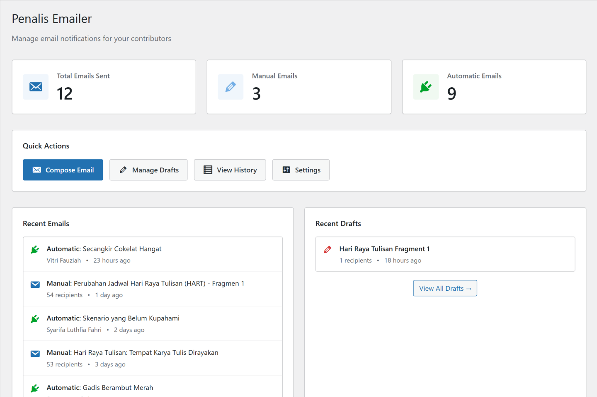
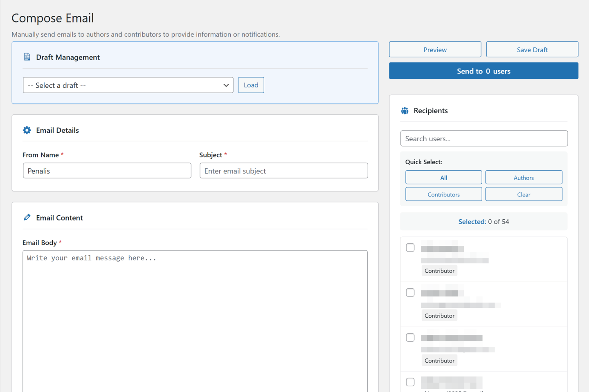
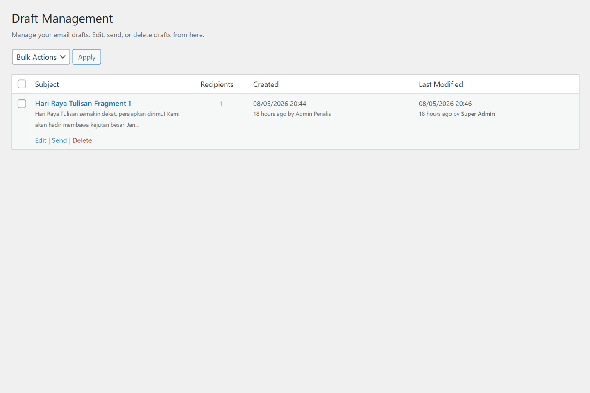
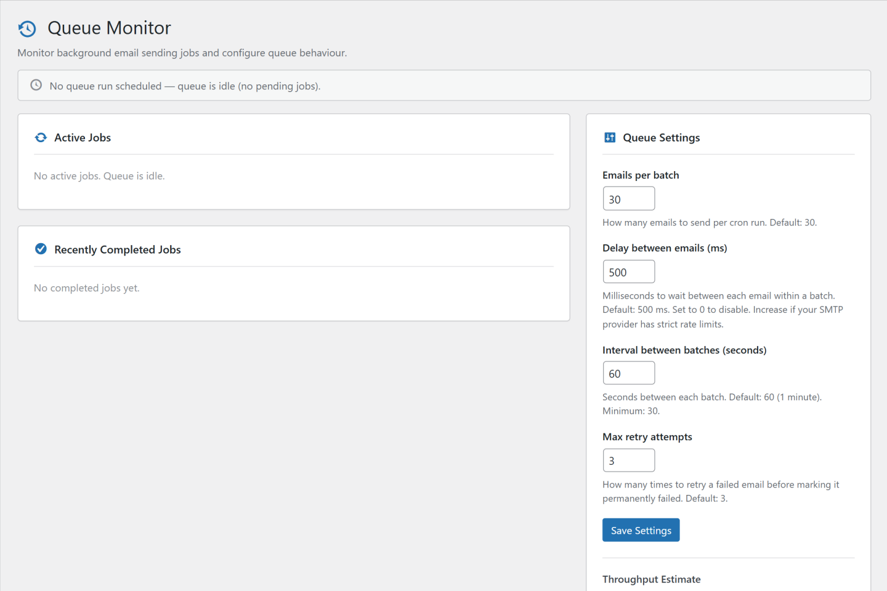
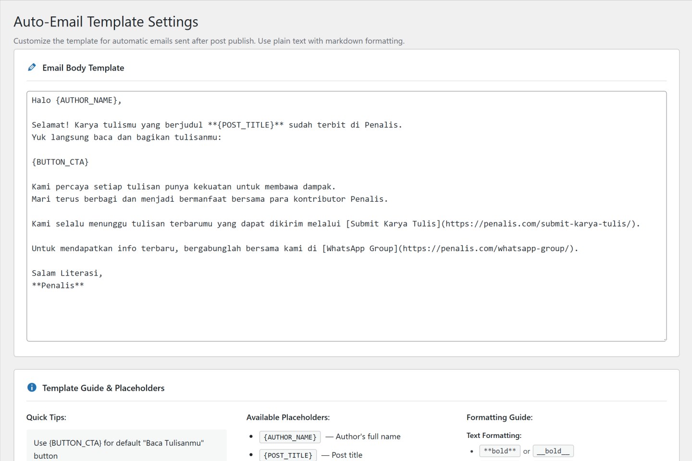
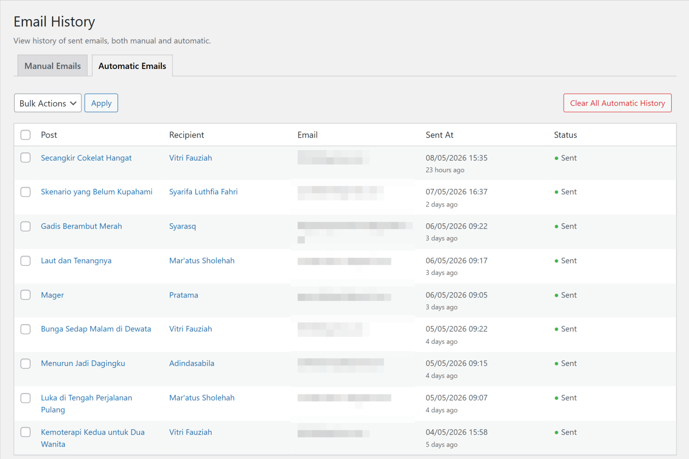

# Penalis Emailer

A WordPress plugin that automatically notifies post authors via HTML email when their posts are published, with a comprehensive admin interface for manual email management including background queue processing and draft management.

> **Note:** This plugin was originally developed for internal use at [Penalis](https://penalis.com). It is publicly available so others can use it in their own projects if they find it useful.

## Why This Plugin Exists

Most WordPress email plugins focus on newsletters or marketing automation.  
Penalis Emailer was built specifically for editorial workflows and contributor communication inside content-driven teams.

The plugin focuses on:
- simple author notifications
- internal editorial communication
- background-safe delivery
- lightweight architecture without external dependencies

## Features

- Automatic email notifications to post authors on publish
- Manual email sending to selected authors and contributors
- Emails sent in background batches via WP-Cron, fully configurable
- Email draft management with auto-save and team transparency
- Queue Monitor page for job tracking and configuration
- Real-time progress banner with AJAX polling
- Markdown-based email composer with responsive HTML rendering
- Email activity history with bulk cleanup tools

## Requirements

- WordPress 6.6 or higher
- PHP 7.4 or higher
- No external dependencies required

## Installation

1. Download the latest ZIP from the [Releases](../../releases) page
2. In WordPress admin, go to **Plugins → Add New → Upload Plugin**
3. Upload the ZIP and click **Install Now**, then **Activate**
4. *(Optional)* Configure an SMTP plugin for reliable email delivery
5. *(Optional)* Adjust queue settings at **Penalis Email → Queue Monitor**

## Usage

### Automatic Notifications

Once activated, the plugin automatically sends an email to the post author whenever a post is published. No configuration required. The email template can be customized at Penalis Email → Template Settings.

### Manual Email Sending

Go to **Penalis Email → Compose**:

1. Enter subject and from name
2. Write the message in markdown
3. Select recipients from authors and contributors
4. Preview, then click **Send Email**

Emails are sent asynchronously in the background. A progress banner shows real-time delivery status after sending.

### Drafts

Go to **Penalis Email → Drafts** to manage saved drafts. Drafts are auto-saved every 60 seconds while composing. Each draft records who created it, who last edited it, and who sent it.

### Queue Monitor

Go to **Penalis Email → Queue Monitor** to view active jobs, configure batch settings, and monitor queue statistics.

### Template Customization

Go to **Penalis Email → Template Settings** to customize the automatic email template using markdown and placeholders such as `{AUTHOR_NAME}`, `{POST_TITLE}`, and `{POST_URL}`.

### Email History

Go to **Penalis Email → Email History** to view all sent emails. Manual and automatic emails are shown in separate tabs. Supports bulk delete and clear all per tab.

## Known Limitations

- WP-Cron must be functioning correctly for queued emails to process
- Queue processing speed depends on WP-Cron frequency and SMTP provider rate limits. Default settings send 30 emails/minute.
- Designed primarily for editorial and contributor workflows, not bulk marketing campaigns

## Documentation

- [Developer Guide](./docs/developer-guide.md) — architecture, file structure, key components, configuration
- [Hooks Reference](./docs/hooks.md) — all filters and actions with usage examples

## License

GPL v2 or later. See [license.txt](./license.txt) for details.
